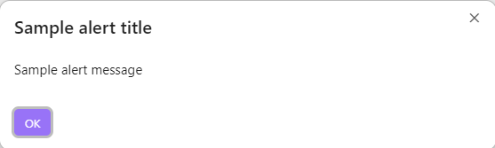

# Obsidian Dev Utils [](https://npmjs.org/package/obsidian-dev-utils)

`Obsidian Dev Utils` is a collection of essential functions and CLI tools designed to streamline your Obsidian plugin development process. Whether you're building a plugin from scratch or enhancing an existing one, these utilities are here to simplify your workflow.

## What is Obsidian?

[Obsidian](https://obsidian.md/) is a powerful knowledge base that works on top of a local folder of plain text Markdown files. It's a tool that lets you take notes and organize them, and it supports a rich plugin ecosystem that allows for extensive customization.

## Who Should Use This Package?

This package is ideal for developers who are building or maintaining plugins for Obsidian. It provides a range of tools to make the development process easier, including automated builds, linting, spellchecking, and more.

## Plugin Generator

There is a [Obsidian Plugin Yeoman Generator](https://github.com/mnaoumov/generator-obsidian-plugin) that sets up a new Obsidian plugin project with a basic structure and some useful scripts from this library.

## Installation

To install the package, run the following command:

```bash
npm install obsidian-dev-utils
```

## Usage

### CLI Commands

The package offers several CLI commands to facilitate common development tasks:

#### Build Production Version

```bash
npx obsidian-dev-utils build
```

Compiles the production version of your plugin into the `dist/build` folder.

#### Clean build folder

```bash
npx obsidian-dev-utils build:clean
```

Cleans `dist` folder.

#### Compile code

```bash
npx obsidian-dev-utils build:compile
```

Checks if code compiles.

#### Compile Svelte code

```bash
npx obsidian-dev-utils build:compile:svelte
```

Checks if Svelte code compiles.

#### Compile TypeScript code

```bash
npx obsidian-dev-utils build:compile:typescript
```

Checks if TypeScript code compiles.

#### Build static assets

```bash
npx obsidian-dev-utils build:static
```

Copies `static` folder to `dist` folder.

#### Build Development Version

```bash
npx obsidian-dev-utils dev
```

Compiles the development version of your plugin into the `dist/dev` folder. The `OBSIDIAN_CONFIG_DIR` can be set either as an environment variable or specified in a `.env` file (e.g., `path/to/my/vault/.obsidian`). The command automatically copies the compiled plugin to the specified Obsidian configuration directory and triggers the [Hot Reload] plugin, if it is enabled. If the [Hot Reload] plugin is not installed, it will be installed automatically, and you will need to enable it manually.

#### Format Code

```bash
npx obsidian-dev-utils format
```

Formats your code using [dprint](https://dprint.dev/).

#### Check Code Formatting

```bash
npx obsidian-dev-utils format:check
```

Checks formatting of your code using [dprint](https://dprint.dev/).

#### Lint Code

```bash
npx obsidian-dev-utils lint
```

This command is looking for `eslint.config.js/mjs/cjs/ts/mts/cts` file in the root of your project and if it's not found, it creates it referencing the default configuration.

Lints your code, enforcing a code convention to minimize common errors.

#### Lint and Fix Code

```bash
npx obsidian-dev-utils lint:fix
```

Lints your code and automatically applies fixes where possible.

This command is looking for `eslint.config.mjs` file in the root of your project and if it's not found, it creates it referencing the default configuration.

#### Publish

```bash
npx obsidian-dev-utils publish
```

Publishes the package to NPM. Usually not applicable for plugins.

To bypass manual verification, consider setting `NPM_TOKEN` to the environment variable or in your `.env` file.

#### Spellcheck Code

```bash
npx obsidian-dev-utils spellcheck
```

Checks your code for spelling errors.

#### Version Management

```bash
npx obsidian-dev-utils version <versionUpdateType>
```

Runs build checks before updating the version and releases if all checks pass. The `<versionUpdateType>` can be `major`, `minor`, `patch`, `beta`, or a specific version like `x.y.z[-suffix]`.

If you use `beta` as `<versionUpdateType>` for your Obsidian plugin, the plugin will be deployed compatible to install with [BRAT](https://obsidian.md/plugins?id=obsidian42-brat).

#### Simplified Usage

To simplify the usage of these commands, you can add them to your `package.json`:

```json
{
  "scripts": {
    "build": "obsidian-dev-utils build",
    "build:clean": "obsidian-dev-utils build:clean",
    "build:static": "obsidian-dev-utils build:static",
    "dev": "obsidian-dev-utils dev",
    "lint": "obsidian-dev-utils lint",
    "lint:fix": "obsidian-dev-utils lint:fix",
    "spellcheck": "obsidian-dev-utils spellcheck",
    "version": "obsidian-dev-utils version"
  },
  "...": "..."
}
```

This setup allows you to run the commands using `npm run`, like `npm run build`.

### Helper Functions

`Obsidian Dev Utils` also provides a range of general-purpose and Obsidian-specific helper functions.

The functions are grouped by files and folders and you have multiple ways to import them:

```typescript
import { prompt } from 'obsidian-dev-utils/obsidian/Modal/Prompt';
await prompt({ app, title: 'Enter your name' });

import { Prompt } from 'obsidian-dev-utils/obsidian/Modal';
await Prompt.prompt({ app, title: 'Enter your name' });

import { Modal } from 'obsidian-dev-utils/obsidian';
await Modal.Prompt.prompt({ app, title: 'Enter your name' });

import { obsidian } from 'obsidian-dev-utils';
await obsidian.Modal.Prompt.prompt({ app, title: 'Enter your name' });

import * as obsidianDevUtils from 'obsidian-dev-utils';
await obsidianDevUtils.obsidian.Modal.Prompt.prompt({
  app,
  title: 'Enter your name'
});
```

## Styling

The library provides some extensible styles that you can use to style your plugin UI controls.

In order to use those styles in your plugin, you have to initialize the plugin context:

```ts
import {
  initPluginContext
} from 'obsidian-dev-utils/obsidian/Plugin/PluginContext';

class MyPlugin extends Plugin {
  public override onload(): void {
    initPluginContext(this.app, this.manifest.id);
    // ...
  }
}
```

Default styles are defined in [main.scss](https://github.com/mnaoumov/obsidian-dev-utils/blob/main/src/styles/main.scss).

The list of css classes is defined in [CssClass.ts](https://github.com/mnaoumov/obsidian-dev-utils/blob/main/src/CssClass.ts).

You can override those styles in your plugin's `styles.css` file via adding your plugin's id to the selector, e.g. for plugin `foo-bar`:

```css
.foo-bar.obsidian-dev-utils :invalid {
  box-shadow: 0 0 0 2px var(--text-error);
}
```

## Components

The library provides some components that you can use in your plugin.

See all available components in the [Components](https://github.com/mnaoumov/obsidian-dev-utils/tree/main/src/obsidian/Components) folder.

In order for components to look properly, their styles has to be initialized. See [Styling](#styling) for more details.

Example of all settings components: built-in and custom:


## Modals

The library provides some modals that you can use in your plugin.

See all available modals in the [Modals](https://github.com/mnaoumov/obsidian-dev-utils/tree/main/src/obsidian/Modals) folder.

In order for models to look properly, their styles has to be initialized. See [Styling](#styling) for more details.

Example of all modals:




## Debugging

By default, console debug messages are not shown. To enable them you have to enable `Verbose` mode in the console settings.


When you enable `Verbose` mode, you will see debug messages in the console sent via `console.debug()` calls.

`obsidian-dev-utils` library uses [debug](https://github.com/debug-js/debug) library to enable conditional logging.

By default, none of the debug messages are shown. You have to enable the debug namespace explicitly.

To see debug messages for your plugin `foo-bar`, you have to enable them:

```javascript
window.DEBUG.enable('foo-bar'); // show all debug messages from the `foo-bar` plugin
window.DEBUG.enable('foo-bar:obsidian-dev-utils:*'); // show all debug messages from the `obsidian-dev-utils` library within the `foo-bar` plugin
window.DEBUG.enable('foo-bar:*'); // show all debug messages from the `foo-bar` plugin and its submodules
window.DEBUG.enable('*:obsidian-dev-utils:*'); // show all debug messages for the `obsidian-dev-utils` library within any plugin
window.DEBUG.enable('*'); // show all debug messages
```

See full documentation of [`window.DEBUG`](https://github.com/mnaoumov/obsidian-dev-utils/blob/main/src/DebugController.ts).

> [!NOTE]
>
> You will see `StackTraceFakeError` in the debug messages. They are not actual errors. It's just a workaround to make stack trace links clickable.

## Support

<a href="https://www.buymeacoffee.com/mnaoumov" target="_blank"></a>

## License

© [Michael Naumov](https://github.com/mnaoumov/)

[Hot Reload]: https://github.com/pjeby/hot-reload
