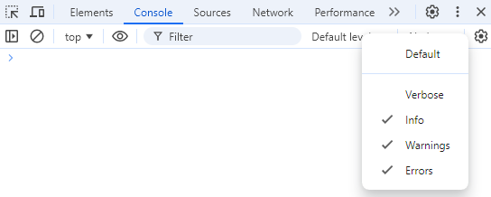

# Debugging

By default, console debug messages are not shown. To enable them you have to enable `Verbose` mode in the console settings.



When you enable `Verbose` mode, you will see debug messages in the console sent via `console.debug()` calls.

`obsidian-dev-utils` uses [debug](https://github.com/debug-js/debug) library to enable conditional logging.

By default, none of the debug messages are shown. You have to enable the debug namespace explicitly.

To see debug messages for your plugin `foo-bar`, you have to enable them by running the corresponding command in the console:

```javascript
window.DEBUG.enable('foo-bar'); // show all debug messages from the `foo-bar` plugin
window.DEBUG.enable('foo-bar:obsidian-dev-utils:*'); // show all debug messages from the `obsidian-dev-utils` library within the `foo-bar` plugin
window.DEBUG.enable('foo-bar:*'); // show all debug messages from the `foo-bar` plugin and its submodules
window.DEBUG.enable('*:obsidian-dev-utils:*'); // show all debug messages for the `obsidian-dev-utils` library within any plugin
window.DEBUG.enable('*'); // show all debug messages
```

See full documentation of [`window.DEBUG`](https://github.com/mnaoumov/obsidian-dev-utils/blob/main/src/DebugController.ts).

> [!NOTE]
>
> You will see `CustomStackTraceError` in the debug messages. They are not actual errors. It's just a workaround to make stack trace links clickable.
>
> Do not add `window.DEBUG` calls in your plugin code. This is designed to be run only from the console.

In order to write your debug messages from your plugin, use:

```js
plugin.consoleDebug('foo', 'bar', 'baz');
```
