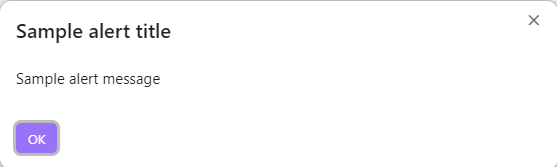
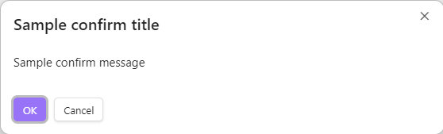
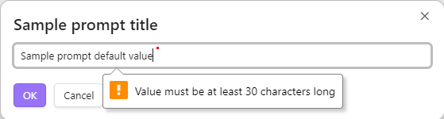
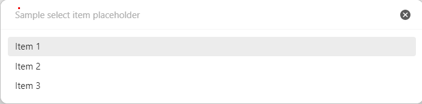

# Modals

`Obsidian Dev Utils` provides some modals that you can use in your plugin.

In order for models to look properly, their styles have to be initialized. See [Styling](./styling.md) for more details.

## Alert

```ts
import { alert } from 'obsidian-dev-utils/obsidian/Modal/Alert';

await prompt({
  app,
  message: 'Sample alert message',
  title: 'Sample alert title'
});
```



## Confirm

```ts
import { confirm } from 'obsidian-dev-utils/obsidian/Modal/Confirm';

await confirm({
  app,
  message: 'Sample confirm message',
  title: 'Sample confirm title'
});
```



## Prompt

```ts
import { prompt } from 'obsidian-dev-utils/obsidian/Modal/Prompt';
import { MaybeReturn } from 'obsidian-dev-utils/Type';

await prompt({
  app,
  message: 'Sample prompt message',
  title: 'Sample prompt title',
  valueValidator(value: string): MaybeReturn<string> {
    if (value.length<30>) {
      return 'Value must be at least 30 characters long';
    }
  }
});
```



## Select Item

```ts
import { selectItem } from 'obsidian-dev-utils/obsidian/Modal/SelectItem';

await selectItem({
  app,
  items: ['Item 1', 'Item 2', 'Item 3'],
  itemTextFunc(item: string): string {
    return item;
  },
  placeholder: 'Sample select item placeholder'
});
```


