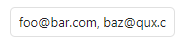

# Setting Components

`Obsidian Dev Utils` provides some setting components that you can use in your plugin.

In order for components to look properly, their styles has to be initialized. See [Styling](./styling.md) for more details.

## CheckboxComponent

```ts
import { CheckboxComponent } from 'obsidian-dev-utils/obsidian/Components/SettingComponent/CheckboxComponent';

const checkbox = new CheckboxComponent(containerEl);
checkbox.setValue(false);

// or

import { SettingEx } from 'obsidian-dev-utils/obsidian/SettingEx';

new SettingEx()
  .addCheckbox((checkbox) => {
    checkbox.setValue(false);
  });
```


## CodeHighlighterComponent

```ts
import { CodeHighlighterComponent } from 'obsidian-dev-utils/obsidian/Components/SettingComponent/CodeHighlighterComponent';

const codeHighlighter = new CodeHighlighterComponent(containerEl);
codeHighlighter
  .setLanguage('javascript')
  .setValue(`function foo() {
  console.log('bar');
}`);

// or

import { SettingEx } from 'obsidian-dev-utils/obsidian/SettingEx';

new SettingEx()
  .addCodeHighlighter((codeHighlighter) => {
    codeHighlighter
      .setLanguage('javascript')
      .setValue(`function foo() {
  console.log('bar');
}`);
  });
```


## DateComponent

```ts
import { DateComponent } from 'obsidian-dev-utils/obsidian/Components/SettingComponent/DateComponent';

const date = new DateComponent(containerEl);
date.setValue(new Date());

// or

import { SettingEx } from 'obsidian-dev-utils/obsidian/SettingEx';

new SettingEx()
  .addDate((date) => {
    date.setValue(new Date());
  });
```


## DateTimeComponent

```ts
import { DateTimeComponent } from 'obsidian-dev-utils/obsidian/Components/SettingComponent/DateTimeComponent';

const dateTime = new DateTimeComponent(containerEl);
dateTime.setValue(new Date());

// or

import { SettingEx } from 'obsidian-dev-utils/obsidian/SettingEx';

new SettingEx()
  .addDateTime((dateTime) => {
    dateTime.setValue(new Date());
  });
```


## EmailComponent

```ts
import { EmailComponent } from 'obsidian-dev-utils/obsidian/Components/SettingComponent/EmailComponent';

const email = new EmailComponent(containerEl);
email.setValue('foo@bar.com');

// or

import { SettingEx } from 'obsidian-dev-utils/obsidian/SettingEx';

new SettingEx()
  .addEmail((email) => {
    email.setValue('foo@bar.com');
  });
```


## FileComponent

```ts
import { FileComponent } from 'obsidian-dev-utils/obsidian/Components/SettingComponent/FileComponent';

const file = new FileComponent(containerEl);
file.onChange((value) => console.log(value));

// or

import { SettingEx } from 'obsidian-dev-utils/obsidian/SettingEx';

new SettingEx()
  .addFile((file) => {
    file.onChange((value) => console.log(value));
  });
```


## MonthComponent

```ts
import { MonthComponent } from 'obsidian-dev-utils/obsidian/Components/SettingComponent/MonthComponent';

const month = new MonthComponent(containerEl);
month.setValue({
  month: 4,
  year: 2025
});

// or

import { SettingEx } from 'obsidian-dev-utils/obsidian/SettingEx';

new SettingEx()
  .addMonth((month) => {
    month.setValue({
      month: 4,
      year: 2025
    });
  });
```


## MultipleDropdownComponent

```ts
import { MultipleDropdownComponent } from 'obsidian-dev-utils/obsidian/Components/SettingComponent/MultipleDropdownComponent';

const multipleDropdown = new MultipleDropdownComponent(containerEl);
multipleDropdown.addOptions({
  Value1: 'Display 1',
  Value2: 'Display 2',
  Value3: 'Display 3',
  Value4: 'Display 4',
  Value5: 'Display 5'
});
multipleDropdown.setValue(['Value2', 'Value3']);

// or

import { SettingEx } from 'obsidian-dev-utils/obsidian/SettingEx';

new SettingEx()
  .addMultipleDropdown((multipleDropdown) => {
    multipleDropdown.addOptions({
      Value1: 'Display 1',
      Value2: 'Display 2',
      Value3: 'Display 3',
      Value4: 'Display 4',
      Value5: 'Display 5'
    });
    multipleDropdown.setValue(['Value2', 'Value3']);
  });
```


## MultipleEmailComponent

```ts
import { MultipleEmailComponent } from 'obsidian-dev-utils/obsidian/Components/SettingComponent/MultipleEmailComponent';

const multipleEmail = new MultipleEmailComponent(containerEl);
multipleEmail.setValue(['foo@bar.com', 'baz@qux.com']);

// or

import { SettingEx } from 'obsidian-dev-utils/obsidian/SettingEx';

new SettingEx()
  .addMultipleEmail((multipleEmail) => {
    multipleEmail.setValue(['foo@bar.com', 'baz@qux.com']);
  });
```



## MultipleFileComponent

```ts
import { MultipleFileComponent } from 'obsidian-dev-utils/obsidian/Components/SettingComponent/MultipleFileComponent';

const multipleFile = new MultipleFileComponent(containerEl);
multipleFile.onChange((value) => console.log(value));

// or

import { SettingEx } from 'obsidian-dev-utils/obsidian/SettingEx';

new SettingEx()
  .addMultipleFile((multipleFile) => {
    multipleFile.onChange((value) => console.log(value));
  });
```


## MultipleTextComponent

```ts
import { MultipleTextComponent } from 'obsidian-dev-utils/obsidian/Components/SettingComponent/MultipleTextComponent';

const multipleText = new MultipleTextComponent(containerEl);
multipleText.setValue(['foo', 'bar']);

// or

import { SettingEx } from 'obsidian-dev-utils/obsidian/SettingEx';

new SettingEx()
  .addMultipleText((multipleText) => {
    multipleText.setValue(['foo', 'bar']);
  });
```


## NumberComponent

```ts
import { NumberComponent } from 'obsidian-dev-utils/obsidian/Components/SettingComponent/NumberComponent';

const number = new NumberComponent(containerEl);
number.setValue(42);

// or

import { SettingEx } from 'obsidian-dev-utils/obsidian/SettingEx';

new SettingEx()
  .addNumber((number) => {
    number.setValue(42);
  });
```


## PasswordComponent

```ts
import { PasswordComponent } from 'obsidian-dev-utils/obsidian/Components/SettingComponent/PasswordComponent';

const password = new PasswordComponent(containerEl);
password.setValue('foo');

// or

import { SettingEx } from 'obsidian-dev-utils/obsidian/SettingEx';

new SettingEx()
  .addPassword((password) => {
    password.setValue('foo');
  });
```


## TelephoneComponent

```ts
import { TelephoneComponent } from 'obsidian-dev-utils/obsidian/Components/SettingComponent/TelephoneComponent';

const telephone = new TelephoneComponent(containerEl);
telephone.setValue('+123 456 78 90');

// or

import { SettingEx } from 'obsidian-dev-utils/obsidian/SettingEx';

new SettingEx()
  .addTelephone((telephone) => {
    telephone.setValue('+123 456 78 90');
  });
```


On mobile the keyboard for this component changes.


## TimeComponent

```ts
import { moment } from 'obsidian';
import { TimeComponent } from 'obsidian-dev-utils/obsidian/Components/SettingComponent/TimeComponent';

const time = new TimeComponent(containerEl);
time.setValue(moment.duration({ hours: 12, minutes: 34 }));

// or

import { moment } from 'obsidian';
import { SettingEx } from 'obsidian-dev-utils/obsidian/SettingEx';

new SettingEx()
  .addTime((time) => {
    time.setValue(moment.duration({ hours: 12, minutes: 34 }));
  });
```


## TriStateCheckboxComponent

```ts
import { TriStateCheckboxComponent } from 'obsidian-dev-utils/obsidian/Components/SettingComponent/TriStateCheckboxComponent';

const triStateCheckbox = new TriStateCheckboxComponent(containerEl);
triStateCheckbox.setValue(null);

// or

import { SettingEx } from 'obsidian-dev-utils/obsidian/SettingEx';

new SettingEx()
  .addTriStateCheckbox((triStateCheckbox) => {
    triStateCheckbox.setValue(null);
  });
```


## TypedDropdownComponent

```ts
import { TypedDropdownComponent } from 'obsidian-dev-utils/obsidian/Components/SettingComponent/TypedDropdownComponent';

export class TypedItem {
  public static readonly Bar = new TypedItem('Bar');
  public static readonly Baz = new TypedItem('Baz');
  public static readonly Foo = new TypedItem('Foo');

  public constructor(public readonly name: string) {}
}

const typedDropdown = new TypedDropdownComponent(containerEl);
const map = new Map<TypedItem, string>();
map.set(TypedItem.Foo, 'Display Foo');
map.set(TypedItem.Bar, 'Display Bar');
map.set(TypedItem.Baz, 'Display Baz');
typedDropdown.addOptions(map);
typedDropdown.setValue(TypedItem.Bar);

// or

import { SettingEx } from 'obsidian-dev-utils/obsidian/SettingEx';

export class TypedItem {
  public static readonly Bar = new TypedItem('Bar');
  public static readonly Baz = new TypedItem('Baz');
  public static readonly Foo = new TypedItem('Foo');

  public constructor(public readonly name: string) {}
}

new SettingEx()
  .addTypedDropdown((typedDropdown) => {
    const map = new Map<TypedItem, string>();
    map.set(TypedItem.Foo, 'Display Foo');
    map.set(TypedItem.Bar, 'Display Bar');
    map.set(TypedItem.Baz, 'Display Baz');
    typedDropdown.addOptions(map);
    typedDropdown.setValue(TypedItem.Bar);
  });
```


## TypedMultipleDropdownComponent

```ts
import { TypedMultipleDropdownComponent } from 'obsidian-dev-utils/obsidian/Components/SettingComponent/TypedMultipleDropdownComponent';

export class TypedItem {
  public static readonly Bar = new TypedItem('Bar');
  public static readonly Baz = new TypedItem('Baz');
  public static readonly Foo = new TypedItem('Foo');

  public constructor(public readonly name: string) {}
}

const typedMultipleDropdown = new TypedMultipleDropdownComponent(containerEl);
const map = new Map<TypedItem, string>();
map.set(TypedItem.Foo, 'Display Foo');
map.set(TypedItem.Bar, 'Display Bar');
map.set(TypedItem.Baz, 'Display Baz');
typedMultipleDropdown.addOptions(map);
typedMultipleDropdown.setValue([TypedItem.Bar, TypedItem.Baz]);

// or

import { SettingEx } from 'obsidian-dev-utils/obsidian/SettingEx';

export class TypedItem {
  public static readonly Bar = new TypedItem('Bar');
  public static readonly Baz = new TypedItem('Baz');
  public static readonly Foo = new TypedItem('Foo');

  public constructor(public readonly name: string) {}
}

new SettingEx()
  .addTypedMultipleDropdown((typedMultipleDropdown) => {
    const map = new Map<TypedItem, string>();
    map.set(TypedItem.Foo, 'Display Foo');
    map.set(TypedItem.Bar, 'Display Bar');
    map.set(TypedItem.Baz, 'Display Baz');
    typedMultipleDropdown.addOptions(map);
    typedMultipleDropdown.setValue([TypedItem.Bar, TypedItem.Baz]);
  });
```


## UrlComponent

```ts
import { UrlComponent } from 'obsidian-dev-utils/obsidian/Components/SettingComponent/UrlComponent';

const url = new UrlComponent(containerEl);
url.setValue('https://foo.com/');

// or

import { SettingEx } from 'obsidian-dev-utils/obsidian/SettingEx';

new SettingEx()
  .addUrl((dateTime) => {
    url.setValue('https://foo.com/');
  });
```


## WeekComponent

```ts
import { WeekComponent } from 'obsidian-dev-utils/obsidian/Components/SettingComponent/WeekComponent';

const week = new WeekComponent(containerEl);
dateTime.setValue({
  weekNumber: 6,
  year: 2025
});

// or

import { SettingEx } from 'obsidian-dev-utils/obsidian/SettingEx';

new SettingEx()
  .addWeek((week) => {
    dateTime.setValue({
      weekNumber: 6,
      year: 2025
    });
  });
```


