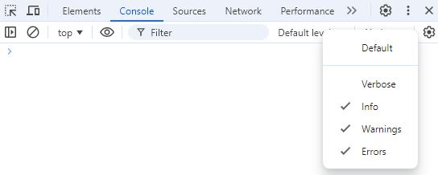

By default, console debug messages are not shown. To enable them you have to enable `Verbose` mode in the console settings.



When you enable `Verbose` mode, you will see debug messages in the console sent via `console.debug()` calls.

`obsidian-dev-utils` uses [debug](https://github.com/debug-js/debug) library to enable conditional logging.

By default, none of the debug messages are shown. You have to enable the debug namespace explicitly.

To see debug messages for your plugin `alpha-bravo`, you have to enable them by running the corresponding command in the console:

```javascript
window.DEBUG.enable('alpha-bravo'); // show all debug messages from the `alpha-bravo` plugin
window.DEBUG.enable('alpha-bravo:obsidian-dev-utils:*'); // show all debug messages from the `obsidian-dev-utils` library within the `alpha-bravo` plugin
window.DEBUG.enable('alpha-bravo:*'); // show all debug messages from the `alpha-bravo` plugin and its submodules
window.DEBUG.enable('*:obsidian-dev-utils:*'); // show all debug messages for the `obsidian-dev-utils` library within any plugin
window.DEBUG.enable('*'); // show all debug messages
```

See full documentation of [`window.DEBUG`](https://github.com/mnaoumov/obsidian-dev-utils/blob/main/src/debug-controller.ts).

> [!NOTE]
>
> You will see `CustomStackTraceError` in the debug messages. They are not actual errors. It's just a workaround to make stack trace links clickable.
>
> Do not add `window.DEBUG` calls in your plugin code. This is designed to be run only from the console.

In order to write your debug messages from your plugin, use:

```js
consoleDebugComponent.debug('alpha', 'bravo', 'charlie');
```

## Advanced Debug Mode

You can use [Advanced Debug Mode](https://community.obsidian.md/plugins/advanced-debug-mode) plugin to configure debug namespaces via Settings UI.

## Cancelling a runaway operation

A vault-wide operation that turns out to be slower, or wronger, than expected can be aborted from the console:

```javascript
__obsidianDevUtils.sharedAbortController.value.abort();
```

This aborts the app-wide shared abort signal, so every operation currently observing it stops. It is shared across every plugin built on `obsidian-dev-utils`, so it cancels whichever one is running.

The signal is replaced immediately after the abort, which means the next operation starts with a fresh one and the call above works as many times as you press it. A plain `AbortController` would stay aborted forever after the first call.

For this to cancel anything, the operation has to be observing that signal in the first place. From plugin code, pass it wherever an `abortSignal` is accepted — most usefully to `loop()`:

```typescript
await loop({
  abortSignal: getSharedAbortSignal(),
  buildNoticeMessage: (file) => `Processing ${file.path}`,
  items: app.vault.getMarkdownFiles(),
  processItem: async (file) => {
    await processFile(file);
  }
});
```

Call `getSharedAbortSignal()` at the start of each operation rather than caching it, or the operation after the first abort starts already aborted.
